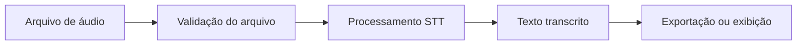

# stt-OPENyA


> Projeto em estruturação para Speech-to-Text, com foco em transformar áudio em texto de forma simples, organizada e pronta para evoluir.

## 📌 Sobre o projeto

**stt-OPENyA** é um projeto pensado para servir como base de uma aplicação de **STT, Speech-to-Text**, capaz de receber arquivos de áudio, processá-los e retornar transcrições em texto.

O repositório ainda está em fase inicial. Este README funciona como a documentação base do projeto, deixando claros os objetivos, a estrutura esperada, as instruções de instalação, formas de uso e próximos passos.

## 🎯 Objetivos

- Converter áudio em texto de forma prática.
- Organizar um fluxo simples para entrada, processamento e saída de transcrições.
- Servir como base para integrações com modelos de transcrição.
- Facilitar testes, manutenção e evolução do projeto.
- Documentar desde o começo para evitar aquele caos clássico de projeto que nasce bonito e vira gaveta digital.

## ✨ Funcionalidades planejadas

- Upload ou leitura de arquivos de áudio.
- Suporte a formatos comuns, como `.mp3`, `.wav`, `.m4a` e `.ogg`.
- Transcrição automática de áudio para texto.
- Exportação da transcrição em `.txt`, `.json` ou outros formatos.
- Separação entre configuração, processamento e interface.
- Possível integração com APIs ou modelos locais de STT.
- Logs básicos para acompanhar erros e processamento.

## 🧠 Como deve funcionar

Fluxo esperado da aplicação:



## 🗂️ Estrutura sugerida do projeto

A estrutura abaixo é uma sugestão para quando o código for adicionado ao repositório:

```txt
stt-OPENyA/
├── README.md
├── LICENSE
├── requirements.txt
├── .env.example
├── src/
│   ├── main.py
│   ├── config.py
│   ├── transcriber.py
│   └── utils.py
├── tests/
│   └── test_transcriber.py
├── samples/
│   └── .gitkeep
└── output/
    └── .gitkeep
```

### Sugestão de responsabilidades

| Caminho | Função |
| --- | --- |
| `src/main.py` | Ponto de entrada da aplicação |
| `src/config.py` | Carregamento de variáveis e configurações |
| `src/transcriber.py` | Lógica principal de transcrição |
| `src/utils.py` | Funções auxiliares |
| `tests/` | Testes automatizados |
| `samples/` | Áudios de exemplo, quando permitido |
| `output/` | Arquivos gerados pela aplicação |

## ⚙️ Requisitos

Como o projeto ainda está em fase inicial, os requisitos abaixo são recomendados para uma base Python:

- Python 3.10 ou superior
- `pip`
- Ambiente virtual, como `venv`
- Dependências futuras listadas em `requirements.txt`

Caso o projeto use outra stack depois, esta seção deve ser atualizada.

## 🚀 Instalação

Clone o repositório:

```bash
git clone https://github.com/sonyddr666/stt-OPENyA.git
cd stt-OPENyA
```

Crie e ative um ambiente virtual:

```bash
python -m venv .venv
```

No Linux ou macOS:

```bash
source .venv/bin/activate
```

No Windows:

```bash
.venv\Scripts\activate
```

Instale as dependências quando o arquivo `requirements.txt` existir:

```bash
pip install -r requirements.txt
```

## 🔐 Variáveis de ambiente

Se o projeto utilizar APIs externas, crie um arquivo `.env` com base em um futuro `.env.example`.

Exemplo:

```env
STT_PROVIDER=local
API_KEY=sua_chave_aqui
OUTPUT_DIR=output
LANGUAGE=pt-BR
```

> Nunca suba chaves reais, tokens ou credenciais para o GitHub.

## ▶️ Uso esperado

Quando a aplicação estiver implementada, um possível uso via terminal pode ser:

```bash
python src/main.py --audio samples/exemplo.mp3
```

Saída esperada:

```txt
Transcrição concluída com sucesso.
Arquivo salvo em: output/exemplo.txt
```

Também pode ser interessante permitir opções como:

```bash
python src/main.py --audio samples/exemplo.mp3 --lang pt-BR --format json
```

## 🧪 Testes

Quando os testes forem adicionados:

```bash
pytest
```

Sugestões de testes importantes:

- Validar arquivos de áudio aceitos.
- Tratar arquivos inexistentes.
- Simular falhas de transcrição.
- Confirmar geração correta dos arquivos de saída.
- Testar configurações obrigatórias.

## 🧰 Tecnologias possíveis

Este projeto pode evoluir usando uma ou mais opções abaixo:

- Python
- Whisper ou alternativas compatíveis de STT
- FastAPI, caso seja criada uma API
- Streamlit ou Gradio, caso seja criada uma interface web simples
- Pytest para testes
- Dotenv para configuração local

A escolha final deve acompanhar o código real do projeto.

## 🛣️ Roadmap

- [ ] Definir stack principal do projeto.
- [ ] Criar estrutura inicial de pastas.
- [ ] Adicionar arquivo de dependências.
- [ ] Implementar leitura de áudio.
- [ ] Implementar transcrição básica.
- [ ] Adicionar exportação de resultado.
- [ ] Criar testes automatizados.
- [ ] Adicionar exemplos de uso.
- [ ] Criar `.env.example`.
- [ ] Definir licença.

## 🤝 Contribuição

Contribuições são bem-vindas quando o projeto estiver pronto para colaboração.

Fluxo sugerido:

1. Faça um fork do projeto.
2. Crie uma branch para sua alteração:

```bash
git checkout -b minha-feature
```

3. Faça as alterações necessárias.
4. Rode os testes.
5. Abra um Pull Request explicando o que foi alterado.

## 🧯 Solução de problemas

### `requirements.txt` não encontrado

O arquivo ainda não foi criado. Adicione as dependências do projeto antes de executar `pip install -r requirements.txt`.

### Erro com arquivo de áudio

Verifique se o arquivo existe, se o caminho está correto e se o formato é suportado.

### Chave de API inválida

Confirme se a variável de ambiente foi configurada corretamente e se a chave usada ainda está ativa.

## 📄 Licença

Este projeto ainda não possui uma licença definida no repositório.

Antes de publicar ou receber contribuições externas, recomenda-se adicionar um arquivo `LICENSE`, como MIT, Apache 2.0 ou outra licença adequada ao objetivo do projeto.

## 👤 Autor

Criado por [@sonyddr666](https://github.com/sonyddr666).

---

Feito para ser uma base clara, extensível e sem aquela energia de arquivo perdido chamado `final_agora_vai_2.py`.
